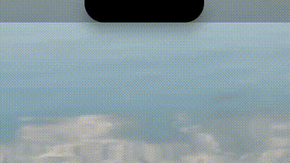

# Brow

[Install](#install) • [Usage](#usage) • [Settings](#settings) • [LLM policy](#llm-policy)


A notch on the GNOME top bar. Hover or click and it opens into an island.



---

### Table of Contents

- [Introduction](#introduction)
- [Features](#features)
- [Prerequisites](#prerequisites)
- [Install](#install)
- [Usage](#usage)
- [Settings](#settings)
- [LLM policy](#llm-policy)

# Introduction

The top bar already marks the top of the screen. Brow sits in the middle of it, flush with the bezel, and only as tall as that bar. At rest it is a notch. Hover or a click opens it into an island. The pointer leaving, a click outside, or another window taking focus closes it again.

Built as a GJS/Clutter extension, so it stays on top of the shell. It is not a separate window.

UUID: `brow@jettakarn`.

# Features

- A notch the height of the GNOME top bar. Hover peeks. Click opens the island.
- Overview: clock, date, weather, and battery.
- Media: album art, title, artist, a seekable progress bar, and previous / play-pause / next. The output button opens Sound settings. Click the album art for a tall player, and click it again to return.
- While music plays, the closed island shows the cover on the left and a spectrum on the right, tinted from the art.
- Charging and low-battery banners. Each holds for about three seconds, then the island shrinks back.
- A volume bar when the system output volume changes. Drag the track to set the level. It holds for about two and a half seconds.
- Search. Type an address or a query and press Enter. The default browser opens, and the island closes and clears.
- Four shortcut chips. A short press launches the app. A long press picks a different installed app.
- Settings live in the island: temperature, clock, and the overlays below.
- Scroll or swipe cycles the tabs and wraps around: Overview, Media, Search, Shortcuts, Settings.
- Experimental fingerprint island. When fprintd starts a verify, the island becomes a rounded square with a breathing scan. A match becomes a check. A miss shakes. Switching to a password returns to the notch.

Overlays do not stack. Fingerprint auth takes the island from the volume bar, and the volume bar takes it from a battery banner. A timed banner that was interrupted comes back if its time has not run out. Auth clears the timed ones.

# Prerequisites

- GNOME Shell 45 or newer
- [`playerctl`](https://github.com/altdesktop/playerctl) for media metadata and controls
- Network access for weather (IP geolocation and [Open-Meteo](https://open-meteo.com/))
- Optional: `fprintd` (or a compatible `open-fprintd`) and an enrolled finger, for the fingerprint island

The fingerprint island only runs inside the user session. The GDM greeter is out of scope.

# Install

```sh
git clone https://github.com/jettakarn/brow.git
cd brow
mkdir -p ~/.local/share/gnome-shell/extensions
ln -sfn "$(pwd)" ~/.local/share/gnome-shell/extensions/brow@jettakarn
glib-compile-schemas ~/.local/share/gnome-shell/extensions/brow@jettakarn/schemas
gnome-extensions enable brow@jettakarn
```

On Wayland, log out and back in once so the shell can see the new extension. After that, disable and enable Brow to pick up code changes.

# Usage

| Action | Effect |
|--------|--------|
| Hover | Peek the clock and battery, or the cover and spectrum while music plays |
| Click | Open or close the island. If music is playing, it opens on Media |
| Scroll or swipe while open | Cycle tabs: Overview, Media, Search, Shortcuts, Settings |
| Search, then Enter | Open the address, or a Google search, in the default browser. The island closes and clears |
| Plug in power | Green charging banner for about 3 seconds |
| Battery at or below the low threshold, while discharging | Red low-battery banner for about 3 seconds, once per drop |
| Volume up, down, or mute | Volume bar for about 2.5 seconds. Drag the track to set the level |
| Fingerprint verify | Square scan, then a check or a shake |
| Media, album art | Open or close the tall player. While it is open, a click outside closes the island. Moving the pointer away does not |
| Media, output icon or Sound | Open Settings, Sound |
| Media, transport | Previous, play-pause, or next through `playerctl` |
| Shortcuts, short press | Launch the assigned app |
| Shortcuts, long press | Pick a different installed app for that chip |

# Settings

Settings are a tab in the island, not a separate preferences window.

- **Temperature** is Celsius or Fahrenheit. Celsius is the default.
- **Clock** is 24-hour or 12-hour.
- **Volume** shows or hides the volume bar.
- **Battery** shows or hides the charging and low-battery banners.
- **Low battery** is 15%, 20%, or 25%. The default is 20%. The banner appears once when the level drops to that threshold while discharging, and it resets after charging above it.
- **Fingerprint** turns the experimental island on or off.

# LLM policy

This repository was developed with AI. The extension and this README were written with an AI coding assistant, then reviewed and kept by the maintainer.

AI-assisted contributions are fine. Say so in the pull request, keep the change small enough to review, and answer questions about it yourself.
